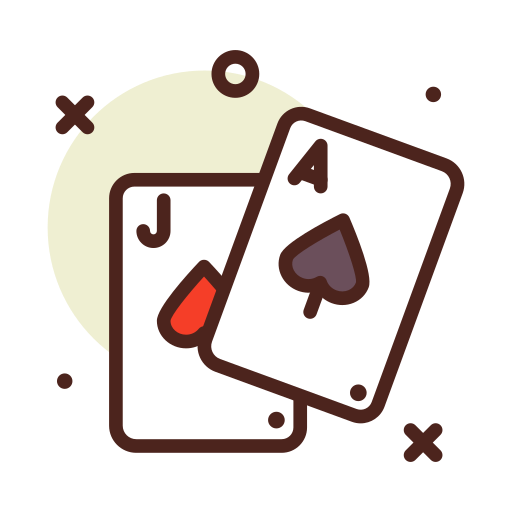

<a href="https://lnbits.com" target="_blank" rel="noopener noreferrer">
  <picture>
    <source media="(prefers-color-scheme: dark)" srcset="https://i.imgur.com/QE6SIrs.png">
    
  </picture>
</a>

# Blackjack - _[LNbits](https://lnbits.com) extension_

**A Lightning-powered blackjack table for LNbits.**  
Create a dealer, share a public game page, accept bets in sats, and settle hands automatically through the dealer wallet.

---

### Quick Links

- [Overview](#overview)
- [Features](#features)
- [Dealer Setup](#dealer-setup)
- [Playing a Hand](#playing-a-hand)
- [Public Game Page](#public-game-page)
- [Payouts and Fair Play](#payouts-and-fair-play)

## Features

- **Create blackjack dealers** with min/max bets, deck count, payout ratio, and optional rake settings
- **Share a public table** for each dealer with a simple `/blackjack/{dealer_id}` game page
- **Accept Lightning payments** before a hand starts
- **Play hit / stand** in the browser with realtime game state updates
- **Automatic payouts** for wins and pushes
- **Provably-fair style flow** with server seed and seed hash shown during play
- **Dealer wallet control** so each table runs from a specific LNbits wallet

## Overview

Blackjack is a small, focused game extension. An operator creates one or more dealers in LNbits, connects each dealer to a wallet, and publishes a public game page for players.

Each hand starts with a bet. After the invoice is paid, the round begins, cards are dealt, and the player can hit or stand until the hand resolves. Winning hands receive automatic payouts back to the player Lightning Address.

The extension is intentionally narrow:

- one game
- one public flow
- one clear settlement path

## Dealer Setup

1. Open the Blackjack extension in LNbits.

2. Create a dealer.

3. Pick the dealer wallet and configure the table:
   - Dealer name
   - Minimum bet
   - Maximum bet
   - Number of decks
   - Blackjack payout ratio
   - Optional rake behavior

4. Save the dealer.

5. Share the public dealer page with players.

### Example

## Playing a Hand

1. Open the public game page for a dealer.

2. Enter:
   - Bet amount
   - Lightning Address for winnings

3. Pay the invoice to start the hand.

4. Play the round:
   - `Hit` for another card
   - `Stand` to end your turn

5. The game resolves automatically:
   - player busts
   - dealer busts
   - player wins
   - dealer wins
   - push

6. Winning hands are paid out automatically to the supplied Lightning Address.

## Public Game Page

Each dealer exposes a shareable public page at:

`/blackjack/{dealers_id}`

That page shows the table, current hand state, invoice flow, and the live game controls. It is designed for players, not operators.

## Payouts and Fair Play

- Hands are only playable after payment
- Game state updates in realtime while a hand is active
- The extension stores the server seed and its hash so the round flow can be audited
- Payouts are calculated from the dealer configuration and sent automatically when the hand completes
- If a rake is enabled, the dealer wallet can retain the configured house cut

## Powered by LNbits

LNbits gives Bitcoin apps a lean wallet core, clean APIs, and a modular extension system.

